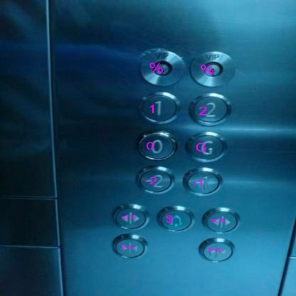
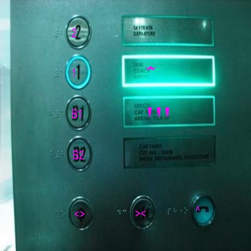

### **Overview**

**Elevator button recognition** is a significant challenge in **multi-floor robot navigation**.
A large variety of button shapes and sizes, panel designs, label types, light conditions and specular reflections make it a very challenging problem.

- We detect buttons on the elevator panel from an image ([yolonas](https://github.com/Deci-AI/super-gradients/blob/master/YOLONAS.md) is used for button detection). I implemented the yolonas model to **improve inference times** on robot CPUs like the **jetson nano**. Results have shown the model to be faster* than the [Faster-RCNN](https://github.com/zhudelong/ocr-rcnn-v2) architecture used before.
- We process the button patches and pass them onto an **OCR model** that returns the text on the buttons. The OCR model was taken from this [drive](https://drive.google.com/file/d/1FVXI-G-EsCrkKbknhHL-9Y1pBshY7JCv/view?usp=sharing) folder that has trained models for this purpose. 

These tasks have been achieved using the [elevator button dataset](https://mycuhk-my.sharepoint.com/personal/1155067732_link_cuhk_edu_hk/_layouts/15/onedrive.aspx?id=%2Fpersonal%2F1155067732%5Flink%5Fcuhk%5Fedu%5Fhk%2FDocuments%2FElevatorButtonDataset%2Ezip&parent=%2Fpersonal%2F1155067732%5Flink%5Fcuhk%5Fedu%5Fhk%2FDocuments&ga=1) after some processing and customizations. 

--- 

### **Installations**

1. Clone the repository and install the requirements mentioned in the [requirements.txt](requirements.txt) file

2. Download the 'training-backup' folder from this [google drive](https://drive.google.com/drive/folders/1KYKRCJL7PH7t3RpmdC353BePR5l-1ADi?usp=sharing) and place it in the repository. 

### **Scripts**

- [inference.py](inference.py) loops over test images, records inference times for each image returns a summary of the times. 

- [visual_inference.py](visual_inference.py) can be used to visualize model results for selected range of images.

- [button_detection.py](button_detection.py) demonstrates results of the yolonas model on elevator panels.

- [character_recognition.py](character_recognition.py) demonstrates results of OCR model on buttons. 

--- 

### **Some results**

